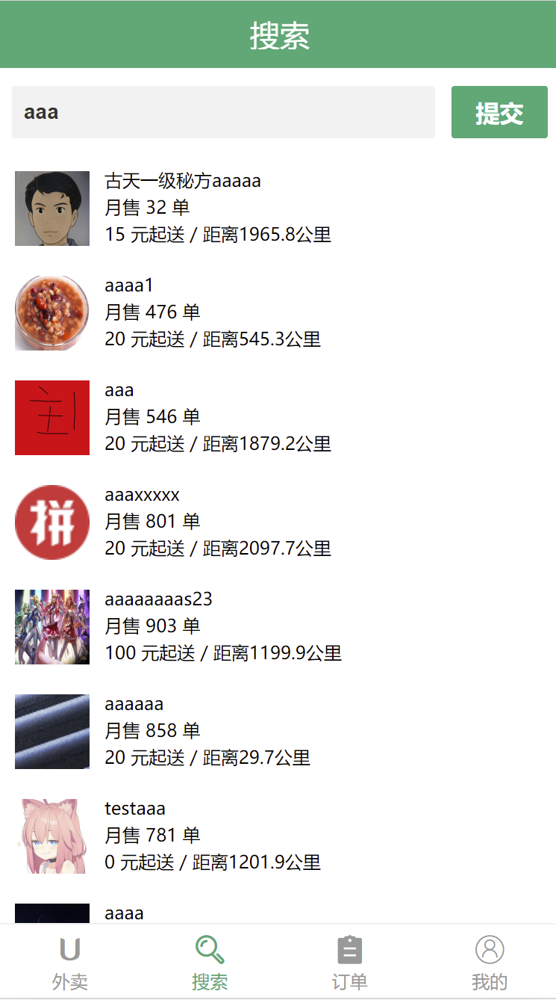
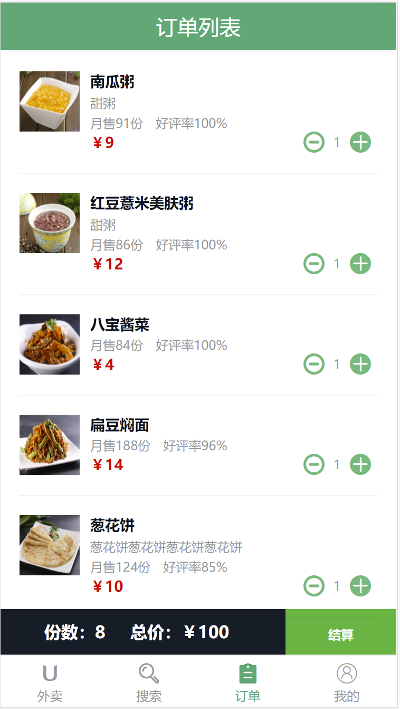
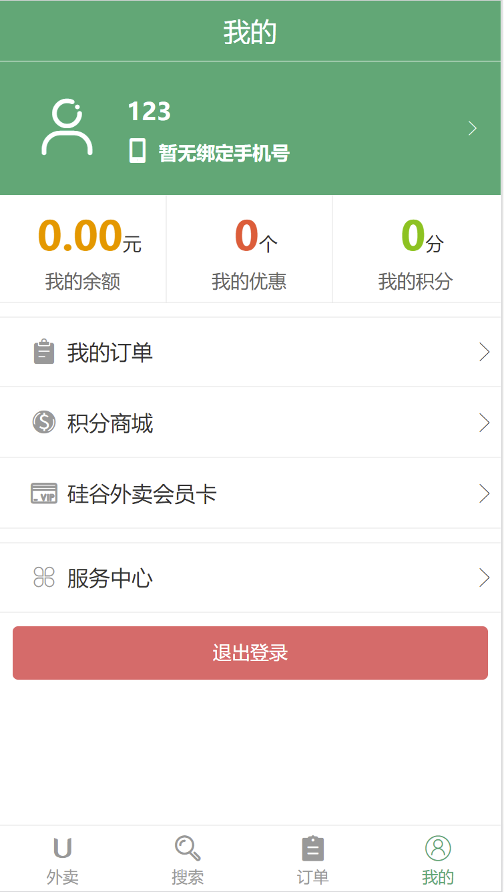

# 硅谷外卖(GoodShop)
> 启动项目失败的话，删除 node_modules，在运行命令 npm install 重新下载


**目录**

---

[toc]

## 1. 项目启动


+ 后台数据库
  + 打开根文件目录，在 `server` 文件中，执行命令：`npm start`
+ 前台页面
  + 打开根文件目录，执行命令：`npm i `，下载所有需要的包
  + 下载完成后，执行：`npm run dev` 或 `yarn dev` 即可
+ 注意：
  + 必须先开启后台数据库，才能正常访问前台页面
  + 搜索页仅支持英文搜索


## 2. 项目描述

1. 此项目为一个前后端分离的外卖 Web App (SPA) 项目
2. 使用了 Vue 全家桶+ES6+Webpack 等前端最新技术
3. 包括商家, 商品, 购物车, 用户等多个功能子模块
4. 采用模块化、组件化、工程化的模式开发


## 3. 技术选型


+ 前台数据处理/交互/组件化
  + vue 全家桶
    + vue
    + vue-router
    + vuex
    + element-ui
    + vue-lazyload
    + vue-scroller
  + 滑动库
    + vue-scroller
    + better-scroll
    + swiper
  + 日期处理
    + moment
    + date-fns
+ 前后台交互
  + 服务器代理
    + vue-cli
  + ajax 请求
    + axios
+ 模块化
  + ES6
  + babel
+ 项目构建/工程化
  + webpack
  + vue-cli
  + eslint
+ css 预编译器
  + stylus


## 4. 插件


1. `mockjs` 实现没有后台接口时，模拟真实后台接口（没用成）

2. `better-scroll` 实现 `goods` 页面滚动

   ```json
   // better-scroll版本
   "better-scroll": "^1.11.1"
   ```

   1. https://github.com/ustbhuangyi/better-scroll

   2. 运行命令：`npm i`，自动安装 `1.11.1` 版本

   3. 如何使用：

      ~~~jsx
      // vc组件的 method
      _initScroll() {
        this.$nextTick(() => {
          // 初始化
          new BScroll(".menu-wrapper", {	//目标元素节点
            click: true,	//允许点击
          });
          this.foodsWrapper = new BScroll(".foods-wrapper", {	//目标元素节点
            probeType: 2,	//滑动计算,惯性不做计算
            click: true,	//允许点击
          });
      
          // 滑动时触发的事件
          this.foodsWrapper.on("scroll", ({ y }) => {
            this.scrollY = Math.abs(y);
          });
      
          // 解决惯性问题导致的不更新区块
          this.foodsWrapper.on("scrollEnd", ({ y }) => {
            this.scrollY = Math.abs(y);
          });
        });
      },
      ~~~

      

3. `swiper` 实现滑动轮播图效果插件

   ~~~jsx
   // 该项目使用的4.x版本
   npm i swiper@4
   
   // vc组件
   methods: {
     _initSwiper() {
       this.$nextTick(() => {
         //此条语句要写到数据更新之后,实现轮播效果
         // 创建一个Swiper实例对象, 来实现轮播
         new Swiper(".swiper-container", {
           loop: true, // 可以循环轮播
           // 如果需要分页器
           pagination: {
             el: ".swiper-pagination",
           },
         });
       });
     },
   },
   ~~~

4. `vue-lazyload` 图片懒加载插件

   + GitHub上搜索按照README文档操作

     1. 执行命令：`npm i vue-lazyload` 

     2. main.js 中写法

        ~~~jsx
        import Vue from 'vue'
        import App from './App.vue'
        import VueLazyload from 'vue-lazyload'
        
        Vue.use(VueLazyload)
        
        // or with options
        const loadimage = require('./assets/loading.gif')
        const errorimage = require('./assets/error.gif')
        
        Vue.use(VueLazyload, {
          preLoad: 1.3,
          error: errorimage,	//图片加载出错显示的图片
          loading: loadimage,	//图片加载中显示的图片
          attempt: 1
        })
        
        new Vue({
          el: 'body',
          components: {
            App
          }
        })
        ~~~

        

5. `date-fns` 日期插件

   1. 执行命令：`npm i date-fns`

   2. 具体代码：

      ~~~jsx
      // filters/index.js 文件
      
      import Vue from "vue";
      // import moment from 'moment'
      import format from "date-fns/format";
      // 自定义过滤器
      Vue.filter("date_format", function (value, formatStr = "yyyy-MM-dd HH:mm:ss") {
      	// return moment(value).format(formatStr)
      	return format(value, formatStr);
      });
      
      ~~~

   3. 使用方法：

      ~~~html
      // 传入一个时间戳,使用 | 链接过滤器名称即可
      <div class="time">{{ rating.rateTime | date_format }}</div>
      ~~~


## 5. 项目截图


### 5.1 外卖页 


### 5.2 搜索页




### 5.3 订单页




### 5.4 我的




### 5.5 购物车页


## 6. 开发中遇到的问题


1. 开启服务器时，自动打开浏览器

   ```jsx
   //vue.config.js
   
   const { defineConfig } = require("@vue/cli-service");
   module.exports = defineConfig({
   	transpileDependencies: true,
    
     //配置内容
   	configureWebpack: {
   		devServer: {
   			port: 8089, //端口号
   			open: true, //自动打开浏览器
   			host: "localhost", //使用的域名
   		},
   	},
   });
   
   ```

   

2. 多次点击同一个 `FooterGuide` 导航链接时，抛错

   + [Intervention]Unable to preventDefault inside passive event listener due to target being treated as passive

   + 解决方法，如下：

     ```css
     // reset文件,添加如下代码即可
     * {
         touch-action: pan-y;
     }
     ```

3. 控制显示 `FooterGuide` 指定匹配到指定路由时显示，不匹配时隐藏

   ~~~jsx
   // 路由表 router/index.js
   {
   	path:'/home',
   	component:Home,
   	mate:{showFooter:true}		//确定显示
   }
   
   // 放置FooterGuide组件的组件,这个是App组件 
   <template>
     <div id="app">
       <router-view />
       <FooterGuide v-show="$route.mate.showFooter"/>
     </div>
   </template>
   ~~~

4. 返回上一个路由

   ~~~jsx
   $router.back()
   ~~~

5. 引入 `axios` 报错

   + 报错信息：

     ```jsx
     BREAKING CHANGE: webpack < 5 used to include polyfills for node.js core modules by default.
     This is no longer the case. Verify if you need this module and configure a polyfill for it.
     
     If you want to include a polyfill, you need to:
     	- add a fallback 'resolve.fallback: { "util": require.resolve("util/") }'
     	- install 'util'
     If you don't want to include a polyfill, you can use an empty module like this:
     	resolve.fallback: { "util": false }
     ```

   + 解决：

     1. 执行命令：`npm install node-polyfill-webpack-plugin`

     2. `src` 同级目录下创建，`webpack.config.js` 中填写如下代码

        ~~~jsx
        const NodePolyfillPlugin = require('node-polyfill-webpack-plugin')
        
        plugins: [
        	new NodePolyfillPlugin()
        ]
        ~~~

6. 根据请求到的新数据实现轮播图

   1. 请求数据完成后，因为页面只能展示8个元素，所以数据需要转换为二维数组遍历

      + 一维遍历页数，二维遍历页数里面的元素

   2. 利用计算属性，处理数据数组

      ```jsx
      // 请求来的数据,存放到vuex公共数据中,key为categorys
      
      // 显示轮播图的组件
      computed:{
      	getCategoryArr(){
      		// 从自身vc身上拿到数据
          let { categorys } = this;
          let arr = [];
          let begin = 0;
          let end = 8;
          for (let i = 0; i < 99999; i++) {
            // 如果本次截取长度大于数组长度,则说明没有数据了
            if (end > categorys.length) {
              end = categorys.length;
            }
            arr.push(categorys.slice(begin, end));
      
            // 当截取的长度到达数组长度即为截取完成,结束循环
            if (end === categorys.length) break;
      
            // 从下一节的第一个开始
            begin = end;
            // 到下一节的最后一个
            end += 8;
          }
          return arr;
      	}
      }
      ```

   3. 遍历完数据

      ~~~vue
      // 显示轮播图的组件
      <div
        class="swiper-slide"
        v-for="(CategoryList, index) in getCategoryArr"
        :key="index"
      >
        <a
          href="javascript:"
          class="link_to_food"
          v-for="(minCategory, index) in CategoryList"
          :key="index"
        >
          <div class="food_container">
          <!-- 将对象内容遍历进去 -->
          
          </div>
          <!-- 将对象内容遍历进去 -->
          <span>{{ minCategory["title"] }}</span>
        </a>
      </div>
      ~~~

   4. 监听全局状态 `state` 属性，即使创建轮播图

      ~~~jsx
      // 显示轮播图的组件
      watch: {
        categorys() {
          this.$nextTick(() => {
            //此条语句要写到数据更新之后,实现轮播效果
            // 创建一个Swiper实例对象, 来实现轮播
            new Swiper(".swiper-container", {
              loop: true, // 可以循环轮播
              // 如果需要分页器
              pagination: {
                el: ".swiper-pagination",
              },
            });
          });
        },
      },
      ~~~

7. 分类列表网慢时显示的，图片判断条件为 `computed` 处理的数据 `category`

   ~~~jsx
   <div class="swiper-container" v-if="getCategoryArr.length > 0"></div>
   ~~~

8. 发送短信验证码
   1. 打开 **荣联·云通讯** 注册一个账号，送 8 块钱
   2. 设置一个测试号码为自己的手机号
   3. 将开发者主账号里的信息，填写到 `server/util/sms_util.js` 中
   4. 根据 API 文档，发送请求即可
9. 短信验证和密码登录
   1. 在 `login` 路由中存放一个 `loginResult` 用于判断登录是否成功
   2. `watch` 监听 `loginResult` 的值是否发生变化，判断其返回状态做操作


## 7. 处理的BUG


1. `/msite` 路由位置，页面滚动时，`li` 的 `before` 伪元素，会在 `HeaderTop` 组件位置一直反复出现
   + 由来： `li:before ` 层级比 `HeaderTop`  高
   + 解决：将 `HeaderTop` 层级调为 300

2. 登录过后，退出，在登陆时，会弹出三个成功登陆

   + 由来：同一个组件触发了多个 `message` 的绑定

   + 解决：将两个函数分开在一个组件中分开即可

     ```js
     		//退出登录的组件  profile组件
     		logout() {
           this.$confirm("是否确定退出登录？", "提示", {
             confirmButtonText: "确定",
             cancelButtonText: "取消",
             type: "warning",
           })
             .then(() => {
               this.$store.dispatch(RESET_USER_INFO);
               this.$message({
                 type: "success",
                 message: "退出成功!",
               });
             })
             .catch(() => {
               this.$message({
                 type: "info",
                 message: "已取消退出",
               });
             });
         },
         //成功登录弹窗  app组件
         succInfo() {
           this.$message({
             message: "登录成功~",
             type: "success",
           });
         },
     ```

3. `mock` 请求数据请求不到，一直报404，只能将 `mock` 数据放到后台服务器上面 

4. `ShopHeader` 左边返回上一页的箭头抛错

   ```js
   Uncaught TypeError: Cannot read properties of null (reading 'match')
   ```

   + 原因：`a` 标签的 `href` 属性未设置
   + 解决：`<a href="javascript:;" class="back" @click.prevent="previous">`

5. `goods` 商品滚动因为惯性问题，不做区块更新

   + 两种解决方法：

     1. `probeType: 3` ，每次滑动都收集 `scrollY` 值；弊端：划得快，区块更新太频繁

        ~~~jsx
        let foodsWrapper = new BScroll(".foods-wrapper", {
        	probeType: 3,
        	click: true,
        });
        ~~~

     2. 添加一个新的事件，`scrollEnd` 滑动结束时；弊端：区块更新不及时

        ~~~jsx
        // 解决惯性问题导致的不更新区块
        	foodsWrapper.on("scrollEnd", ({ y }) => {
        	this.scrollY = Math.abs(y);
        });
        ~~~

6. 点击增加商品个数按钮，弹出 `food` 页面

   + 原因：单击触发了冒泡，使祖先的单击事件被触发

   + 解决：给子孙的单击事件取消冒泡行为

     ~~~jsx
     // 子孙组件 
     @click.stop="updateFoodCount(false)"
     ~~~

7. 第一次进入 `/shop/goods` 时， 滚动条 `better-scroll` 没有加载成功，需要返回上一个路由，在进来即可

   + 原因：进入 `/shop/goods` 时，vuex 获取更新完 goods 后，插件没有进行更新覆盖

   + 解决：请求完毕后，调用的函数先不要执行，让 goods 更新完毕，重新渲染完页面在执行代码即可

     ~~~jsx
     // mounted函数,先判断有没有发送过请求
     if (this.goods.length > 0) {
       this._initScroll();
       this._initTops();
     } else {
       this[RECEIVE_SHOP_GOODS](() => {
         // 等待页面重新渲染完毕在执行
         this.$nextTick(() => {
           this._initScroll();
           this._initTops();
         });
       });
     }
     ~~~

   + 注意：移动端方式预览不知道为啥没法滚动，网页模式就行

8. 点击购物车列表时，`goods` 里面的列表横线层级高于 `ShopCart` 层级
   + 原因：`common/mixins.styl` 中 `bottom-border-1px($color)` 层级过高，调成 `10` 即可

9. 购物车内容显示时，触发滚动效果，第一次滑动无效，第二次才行；并且重复拉开购物车导致，增加商品时，增加好多个

   + 原因：创建 `BScroll` 时，只需要创建一个即可，`if` 判断是否创建过即可；除去第一次创建时，在第二次开始之后，让其内容区域高度重新计算即可

   + 解决：

     ~~~jsx
     // ShopCart.vue文件
     methods: {
       toggleShow() {
         // 购物车内没有内容时,不会打开
         if (this.cartFoods.length === 0) return;
         // 点击时切换购物车显示
         this.isShow = !this.isShow;
         // 购物车显示时
         if (this.isShow) {
           // 等待页面渲染完毕
           this.$nextTick(() => {
             // 给购物车设置滚动效果
             if (!this.scrollVc) {
               this.scrollVc = new BScroll(".list-content", {
                 click: true,
               });
             } else {
               this.scrollVc.refresh(); // 让滚动条刷新一下,重新统计内容高度
             }
           });
         }
       },
     },
     ~~~

     

10. `Swiper` 和 `BScroll`，在当前路由刷新或在其他路由刷新进入该路由时，无法进行初始化，实现效果
    + 原因：
      + 监听数据初始化 `Swiper`，而数据只更新一次，导致只会执行一次
      + `BScroll` 在 `mounted` 时初始化， 应做判断数据还没更新时，去请求在初始化；数据更新完后，再去初始化
    + 解决：
      + 将初始化的代码封装到 `methods` 里，每次 `mounted` 和 `watch` 监听数据时，调用初始化函数

